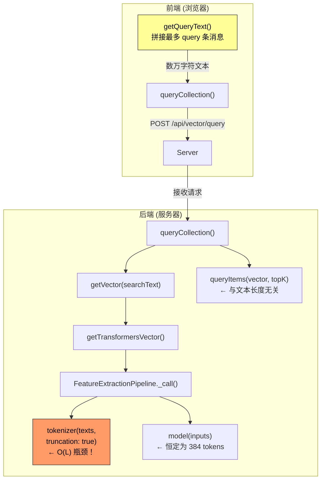

# Vector Query API 性能优化方案

## 问题概述

`POST /api/vector/query` 和 `POST /api/vector/query-multi` 接口在查询文本长度较大时响应缓慢，经常超时。

**用户关键观察**: 查询文本短（几十字）→ 速度快；查询文本长（数万字）→ 速度极慢直至超时。

---

## 根因分析（修正版）

### 真正的瓶颈：查询文本的嵌入向量生成过程

根据用户的反馈，性能瓶颈不在索引搜索，而在 **查询文本的 tokenization 过程**。

#### 调用链路

```
前端 getQueryText()                        ← 拼接最多 query 条消息
  → GET /api/vector/query (searchText)     ← 发送长文本到后端
    → getVector(searchText)                ← 生成查询向量
      → getTransformersVector(searchText)  ← 对长文本做嵌入
        → pipe(text, {pooling:'mean', normalize:true})
          → tokenizer(texts, {padding:true, truncation:true})  ← 对全文做 tokenization！
          → model(model_inputs)            ← ONNX 推理（恒定为 384 tokens）
```

#### 为什么长文本导致性能问题

[`FeatureExtractionPipeline._call()`](node_modules/sillytavern-transformers/src/pipelines.js:1170) 中：

1. **tokenization 步骤**（[第 1176 行](node_modules/sillytavern-transformers/src/pipelines.js:1176)）：
   ```javascript
   const model_inputs = this.tokenizer(texts, {
       padding: true,
       truncation: true,
   });
   ```
   - 对输入的整个文本执行 WordPiece/BPE tokenization
   - **时间复杂度 O(L)**，其中 L 是文本字符长度
   - 数万字符的纯 JavaScript tokenization 耗时可达 **数百毫秒到数秒**

2. **ONNX 模型推理**（[第 1182 行](node_modules/sillytavern-transformers/src/pipelines.js:1182)）：
   - 虽然 truncation 将输入截断到模型最大长度（`Xenova/all-mpnet-base-v2` = 384 tokens）
   - 但 tokenization 的 O(L) 开销已经全部付出了
   - 额外 ONNX 推理 ~200-500ms（WASM 单线程）

3. **浪费比率**：如果用户 `query` 设置较大（如 50 条消息各 500 字 = 25000 字），tokenization 处理全部 25000 字，但模型只使用前 ~384 tokens（约 1500 字）—— **超过 90% 的计算完全浪费**！

#### 为什么之前分析 vectra 索引扫描是次要因素

- `queryItems()` 的复杂度是 O(N × D)，N = 索引中向量数量，D = 向量维度（常数）
- 查询文本的长度 **不影响** 向量搜索的耗时
- 所以当查询文本短时响应快、长时响应慢，问题一定在 `getVector()` 阶段

### 次要瓶颈

1. **[`vectra`](node_modules/vectra/src/LocalIndex.ts) 索引扫描**（O(N×D)）—— 当索引规模很大时仍然有影响，但与查询文本长度无关

2. **多集合串行查询** —— [`multiQueryCollection()`](src/endpoints/vectors.js:407) 串行处理每个集合

3. **索引实例未缓存** —— [`getIndex()`](src/endpoints/vectors.js:300) 每次请求新建 `LocalIndex`，重复读取 `index.json`

---

## 优化方案

### 阶段 1：核心优化 —— 限制查询文本长度（最关键，效果最显著）

**问题**：前端 [`getQueryText()`](public/scripts/extensions/vectors/index.js:901) 将最多 `settings.query` 条消息全部拼接，其中远超过模型最大输入长度的文本被浪费地 tokenize。

**方案 A（推荐）**：在前端 `getQueryText()` 中截断查询文本到合理长度

| 改动点 | 文件 | 行号 |
|--------|------|------|
| 在拼接完查询文本后，截断到最大字符数 | [`public/scripts/extensions/vectors/index.js`](public/scripts/extensions/vectors/index.js:921) | 第 921-923 行 |

```javascript
// 当前代码：
const queryText = hashedMessages.map(x => x.text).join('\n');
return collapseNewlines(queryText).trim();

// 优化后：
const MAX_QUERY_LENGTH = 2000; // 约 500 tokens，足够模型使用
let queryText = hashedMessages.map(x => x.text).join('\n');
queryText = collapseNewlines(queryText).trim();
if (queryText.length > MAX_QUERY_LENGTH) {
    queryText = queryText.slice(0, MAX_QUERY_LENGTH);
}
return queryText;
```

**原理**：
- `all-mpnet-base-v2` 最大输入 = 384 tokens ≈ 1500-2000 英文字符 / 500-800 中文字符
- 超出部分被模型截断丢弃，但 tokenization 成本仍然支付
- 截断后：tokenization 时间从 O(25000) → O(2000)，**预计提升 10x 以上**

**方案 B（备选）**：在服务端 `getVector()` 或 `queryCollection()` 中截断

| 改动点 | 文件 | 行号 |
|--------|------|------|
| 在调用嵌入 API 前截断文本 | [`src/endpoints/vectors.js`](src/endpoints/vectors.js:387) | 第 387 行前 |

```javascript
// 在 getVector 调用前截断
const MAX_TEXT_LENGTH = 2000;
const truncatedText = searchText.length > MAX_TEXT_LENGTH 
    ? searchText.slice(0, MAX_TEXT_LENGTH) 
    : searchText;
const vector = await getVector(source, sourceSettings, truncatedText, true, directories);
```

效果与方案 A 相同，但作为后端兜底更安全。**建议前后端都做**。

**方案 C**：优化 `getTransformersBatchVector` 中的批处理

当前 [`getTransformersBatchVector()`](src/vectors/embedding.js:21) 是伪批处理：
```javascript
for (const text of texts) {
    result.push(await getTransformersVector(text)); // 串行循环
}
```

改为真正的批处理：
```javascript
export async function getTransformersBatchVector(texts) {
    const pipe = await getPipeline(TASK);
    const result = await pipe(texts, { pooling: 'mean', normalize: true });
    return Array.from(result.data);
}
```

利用 transformers.js 的批处理能力，在 ONNX Runtime 中并行处理多个文本。但需注意这要求所有文本使用相同 padding 长度。

### 阶段 2：索引引擎优化

| # | 改动 | 文件 | 说明 |
|---|------|------|------|
| 2.1 | 添加 LocalIndex 实例缓存 | [`src/endpoints/vectors.js:300`](src/endpoints/vectors.js:300) `getIndex()` | 避免重复读盘+JSON 解析 |
| 2.2 | multiQueryCollection 并行化 | [`src/endpoints/vectors.js:407`](src/endpoints/vectors.js:407) | 使用 Promise.all |
| 2.3 | 替换 vectra 为 usearch/HNSW | 新增 `src/vectors/usearch-index.js` | 将 O(N×D) 降至 O(log N) |

### 阶段 3：进一步优化

| # | 改动 | 说明 |
|---|------|------|
| 3.1 | 查询向量结果缓存 | 对相同 `searchText` 的重复查询缓存向量 |
| 3.2 | ONNX 线程数调优 | 在非 Android 平台增加 `numThreads` |
| 3.3 | 添加超时和熔断机制 | 防止慢查询阻塞服务器 |

---

## 关键代码路径

```
查询文本构建 (前端):
  [public/scripts/extensions/vectors/index.js:901](public/scripts/extensions/vectors/index.js:901) getQueryText()
    → 取最多 settings.query 条消息
    → 拼接 → 返回长文本           ← ★ 拼接整个历史

API 请求 (前端):
  [public/scripts/extensions/vectors/index.js:1151](public/scripts/extensions/vectors/index.js:1151) queryCollection()
    → POST /api/vector/query { searchText: "数万字符..." }

嵌入生成 (后端):
  [src/endpoints/vectors.js:385](src/endpoints/vectors.js:385) queryCollection()
    → [src/endpoints/vectors.js:387](src/endpoints/vectors.js:387) getVector(searchText)
      → [src/vectors/embedding.js:10](src/vectors/embedding.js:10) getTransformersVector(text)
        → [node_modules/sillytavern-transformers/src/pipelines.js:1176](node_modules/sillytavern-transformers/src/pipelines.js:1176) tokenizer(texts, ...)  ← ★ O(L) tokenization 瓶颈！

索引搜索 (后端):
  [node_modules/vectra/src/LocalIndex.ts:238](node_modules/vectra/src/LocalIndex.ts:238) queryItems()
    → 遍历所有向量计算余弦相似度  ← 次要瓶颈 (与查询文本长度无关)
```

## 数据流图



## 影响范围

| 改动 | 风险 | 兼容性 | 回退难度 |
|------|------|--------|----------|
| 前端截断查询文本 | 低（纯前端字符串操作） | 完全兼容 | 改一行代码即可回退 |
| 后端截断查询文本 | 低 | 完全兼容 | 改一行代码即可回退 |
| LocalIndex 缓存 | 低 | 完全兼容 | 移除缓存即可 |
| 多集合并行查询 | 中（并发压力增大） | 完全兼容 | 改回串行即可 |
| 替换索引引擎 | 高（需迁移数据） | 需测试 | 需保留 vectra 兼容层 |

---

## 总结

**最重要的优化**：在嵌入向量生成之前，将查询文本截断到模型能处理的最大长度（约 2000 字符）。这直接消除了 O(L) 的 tokenization 瓶颈，预计可将长文本查询速度提升 **10-50 倍**。

其他优化（索引缓存、并行查询、更换索引引擎）可作为后续增强，但不是解决当前超时问题的关键。
